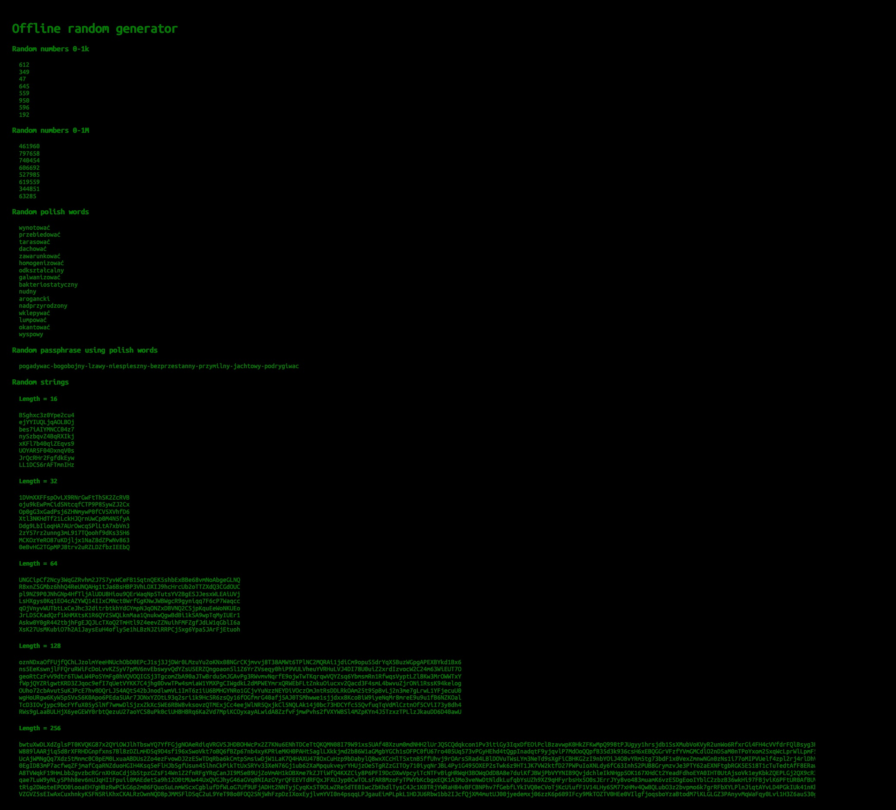

# Offline random generator

Simple HTML+JS based generator of random numbers, strings and words. Does not require internet except for jQuery (which is hosted as `jquery-3.5.0.min.js` along with `index.html`) and Polish dictionary (`slowa.txt`) which is cached in browser's `localStorage` to save bandwith. 

## My instance - https://skowronski.cloud/random/

## Demo

